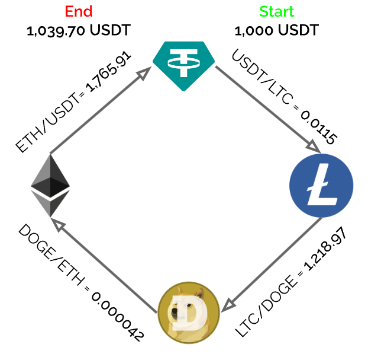
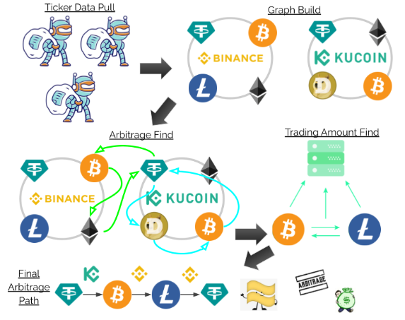

## C++ Crypto Arbitrage Framework
A C++ dominant framework for pulling real-time data via public endpoints from six crypto exchanges to compute a crypto currency arbitrage that is both mathematically profitable and a proper amount to trade to get realistic profitability. The framework can detect bilatreal, trilateral, quadliteral, and pentalateral arbitrages from a single set of crypto currency data.



## Need for Speed, through C++ and Parallelization
Pulling active ticker data and select orderbook data via public API endpoints from all trading pairs across 6 crypto exchanges is about 2.5 MB of JSON string data. This data is used by downloading ticker data, parsing ticker data, performing arbitrage finding algorithm, formatting the arbitrage path, downloading relevant orderbook information, and determining realistic profitability. Most of these are expensive, time consuming operations that in the end will net a path that is deemed profitable. If the path takes too long to compute the profitability/trading opportunity may have disappeared.

For the reason that speed is royalty in this situation, C++ is used on all time dominant operations and all operations that could have benefited from embarrassingly or data parallelism were accommodated. On my own hardware (has not been tested on outside hardware), the time dominant factor of my framework is the time spent downloading from the public endpoint. Over 99% of time is spent simply downloading ticker and orderbook data, which is both good and bad *(See Time BreakDown soon)*. It showcases that the rest of the code is inefficient, but that the code suffers from outside factors that can not be avoided without additional hardware costs. 

## To Use Framework
Install all libraries
```console
$ sudo apt-get install make cmake nlohmann-json3-dev curl python3 pip
```
```console
$ pip install requests bs4
```
```console
$ cmake -b . -s out/build
```
```console
$ cd out/build/ && make && cd ../../
```

More information about single bash script execution coming soon

## Outline


The project is set up into five main section crypto ticker data pulling, graph building, arbitrage finding, orderbook data pulling, and trading amount determination


## Arbitrage Finding Algorithm
Crypto arbitrage refers to the practice of buying and selling cryptocurrencies across different exchanges or markets to take advantage of price discrepancies and make a profit.

### Math Behind the Algorithm
The mathematical formula for an arbitrage is 

StartingCapital $\cdot$ Trade1 $\cdot$ Trade2 $\cdot ...$ TradeN $>$ StartingCapital

For numerical stability with floating point operations, the formula can be converted to 

$ln$(StartingCapital) + $ln$(Trade1) + $ln$(Trade2) + $...$ + $ln$(TradeN) > $ln$(StartingCapital)

With trading fees included,

$ln$(StartingCapital) + $ln$(Trade1) + $ln$(Trade1Fee) + $ln$(Trade2) +

$ln$(Trade2Fee) + $...$ + $ln$(TradeN) + $ln$(TradeNFee) > $ln$(StartingCapital) 


Every set of Trades that satisfy this inequality is considered a profitable arbitrage by purely ticker data. However, there are many sets of trades with a profitability of less than 0.1%, which may be ideal for a high frequency traders but are not viable for an average trader

Adding profit thresholds allows for a certain degree of profitability before a arbitrage path is said to be viable by an individual user, 

$ln$(StartingCapital) + $ln$(Trade1) + $ln$(Trade1Fee) + $ln$(Trade2) +

$ln$(Trade2Fee) + $...$ + $ln$(TradeN) + $ln$(TradeNFee) $> ln$(StartingCapital) + $ln$(1 + LowerThreshold)
- LowerThreshold is percentage expressed as a decimal

### Algorithm and Data Structure Implementation
To find sets of trades that satisfy the equation above, the arbitrage finder [arbitrage_finder.hpp]() implements a brute force path searching algorithm from a given source coin. As every arbitrage path starts and ends with the same coin, each path is a cycle within the graph data structure being used. 

Within this graph data structure, each vertex is a tradable crypto currency and each edge away from said vertex is a trading pair available on same exchange. There may be multiple edges from one vertex to another and that equates to this trading pair available on multiple exchanges. The end goal of discovering an arbitrage path is to complete the trades in the path as soon as possible on relevant exchanges. To do this, a user will end up overspending the average user by placing bids at or above ask price and asks at or below bid price to create the best chance to for automatic order completion. This structure choice makes edge weights in a trading pair the ask price from the start currency to the end currency and bid price for the vice versa.


## Ideal Trading Amount Algorithm
As the arbitrage path finding algorithm satisfies the mathematical formula described above based on ticker prices, the path falls prey to discovering paths that are profitable by ticker data, but the order book lacks liquidity to support a similar profitability. The path may be profitable by ticker data but is fruitless without knowing how much one should trade. 

The ideal trading amount algorithm, [amount_optimization.hpp]() takes the path found by the arbitrage finding algorithm and determines an upperbound for a trading amount. The algorithm will peak into the top-N, N is specified by the user, active trades in the orderbook for each trade in the path. Looking into each of these active trades will allow the algorithm to recognize trading pairs with low liquidity on either the bid or ask side.

The result of this algorithm will determine a realistic profitability, the corollary slippage rate from ticker profitability, and the amount of source capital the user should trade.


## Usability and Flexibility (WIP)
- Entire program is driven from a shell script that will ask user for user options and then begin performing the arbitrage finding
- Talk about path length
- Customizability with profit thresholds
- Trading Amount OPtimization options
- Closed Exchange Option


## Exchange Data Pulling


Pinging and downloading ticker and orderbook data via public exchange endpoints takes a lot of time that cannot be avoided. Each public endpoint web request will take *(See Time BreakDown soon)* between 1 and 3 seconds. To avoid a serial implementation of doing one request after another, the requests are multithreaded (assuming multiple threads are available) to reduce the total time to make all endpoint data requests around 3 seconds with the slowest endpoint request being the bottleneck.

This type of exchange data pulling from public api endpoints is freely available via open-source projects such as [ccxt](https://github.com/ccxt/ccxt) and [freqtrade](https://github.com/freqtrade/freqtrade). I choose six strong exchanges to allow myself the opportunity to learn to pull and manipulate trading data.


## Speed Benchmarks (WIP)
- Coming soon
- Will feature breakdown of time between different processes with different numbers of threads
- Will feature breakdown of bilateral, trilateral, quadlateral, and pentalateral arb finding times with different numbers of threads

## Simulated Results (WIP)
- Coming soon


## Possible Next Steps or Different Directions
- Format the data into, a matrix and using k matrix multiply to maximize the with the entry in the result or intermediate multiply matrix being the argMax of a row from matrixA and column from matrixB
    - Reduces arbitrage algorithm to $O((k+1)*n^{([2.34, 3])})$, where k is the number of desired trades, for larger arbitrage paths and is quite amendable to parallelization
    - Easy to calculate but would be harder to trace the path from the result
- Along with (k+1) matrix multiplies is the idea of tropical algebra for currency arbitrage outlined in this [paper](https://commons.lib.jmu.edu/cgi/viewcontent.cgi?article=1303&context=honors201019) that uses more sophisticated mathematical formuli, such as the kronocker and Karp's Algorithm

- Another option is [Johnson's algorithm](https://en.wikipedia.org/wiki/Johnson%27s_algorithm) or [Floyd-Warshall](https://en.wikipedia.org/wiki/Floyd%E2%80%93Warshall_algorithm) to compute an all pairs 
    - Both will yield the greatest possible profitability for an arbitrage is fed data correctly
    - Both suffer from tracing from profitability to the actual path as multiple intersecting arbitrage paths in the graph will produce incorrect tracing
    - The shortest path from any given vertex to another does not directly result in a arbitrage path, which would imply additional computations
    - No guarantee that the shortest path from one vertex to another and back is of reasonable length (could have very long trade paths)

- A final option is linear programming with a linear solver for both improving the computational speed of the arbitrage finder and amount of optimizer
    - There are multiple providers of free/payed linear solvers such as Gurobi, MATLAB, HiGHS, or any [others](https://www.researchgate.net/post/What_is_the_best_software_available_for_linear_programming)
    - Constraints could be freely added by used such as certain coins to favor or avoid, path length, minimal or maximal exchanges to make trades on, min or max of trading a coin or set of coins, bias towards coins that have or have not been traded before
    - Objective function would be the maximization profit from available trades at any given time 

- Additionally before deploying the framework as an active trading bot, one should consider hooking up the arbitrage paths that the bot finds to a Twilio text message/email bot. The Twilio application could send a user text messages about discovered arbitrage paths and the user could manually check them to recognize potential strengths and weaknesses of this framework. From there, a user can tweak user customization or my code entirely to feel comfortable with the framework before deploying an active trading bot 


## Disclaimer and Drawbacks
- This crypto arbitrage framework was done for **personal interest**. It is possible that this framework will output a **false positive path** that is **produce financial loss** because of outdated orderbook data so any outside use of this code is at the users discretion and risk 
- **Very few exchanges offer cross exchange trades**, so keeping balances on all exchanges in use would be required for the best market order speed efficiency else one would have transfer funds from exchanges and pay additional fees
